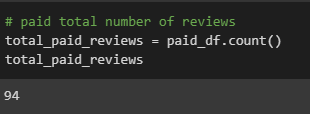
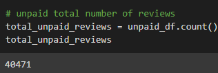
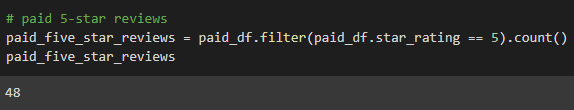
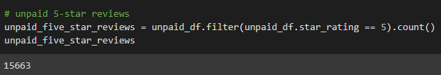
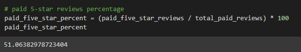

# Amazon Vine Analysis

  -For this weeks project I am working with Jennifer on two fairly big projects. The project I will be focusiong on in this write up is all about the paid Amazon Vine program that lets customers write reviews of Manufacturers and Publishers to receive reviews written by customers. The big part to look at is accessing the nearly 50 data sets. Each set of data will contain it's own specific item. The items in the data sets we are going through aren't of a specific category and are spread out from clothing all the way to electronics. 
  
### Results

  -Firstly I have below shown are Vine reviews. 
  
  
  
  -Next will be nonvine reviews. 
  
  
  
  -For the next two screenshots I will be posting are how many vine reviews were five stars and how many non vine reviews were five stars.
  
   -Vine five stars
    
   
    
   -Non vine five stars
    
   
    
  -Lastly I will show the total percent of Vine five star rviews and non vine five star reviews. 
  
   -Vine percent
    
   
    
   -Non vine percent
    
   
  

 
### Summary
 
  -At the end of going through the data sets I believe that the vine reviews do reveal a bias positively towards the product the review is on but it is in no way affecting the product in an overwhelmingly positive way or swaying the overall ratings as they're so many reviews for each product they seem to ix in just fine with the rest of the reviews.
  
  
